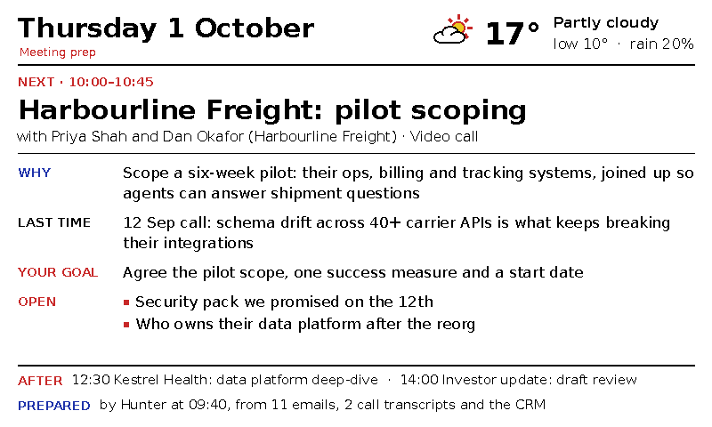
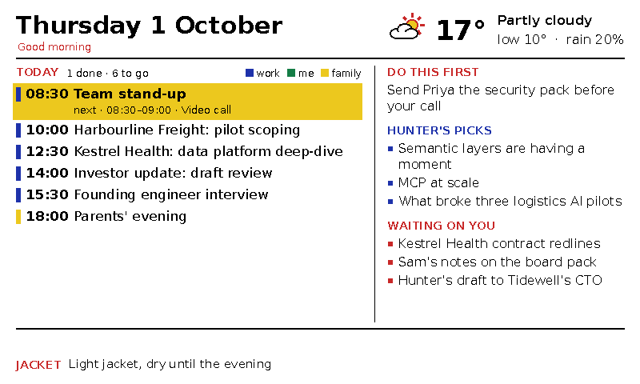
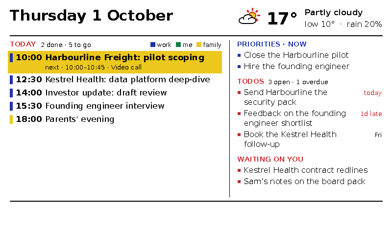
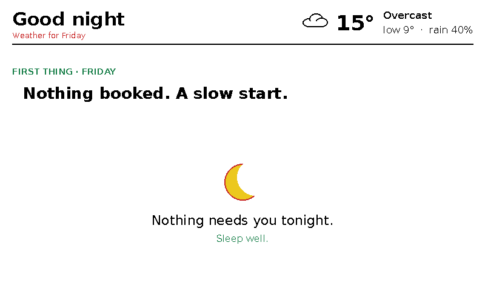

# desk-companion

**A calm e-ink screen for your desk that your AI agent keeps up to date.**

Twenty minutes before each meeting it changes to a prep card: who you're about to
see, why, what happened last time, what you want out of it, and what's still open
between you. The rest of the day it shows your diary, priorities and todos. At
22:00 it says "Good night" and doesn't change again until morning.



*Every screenshot here uses made-up sample data from [`demo/`](demo/).*

It runs on a 7.3" colour e-ink panel driven by [InkyPi](https://github.com/fatihak/InkyPi).
This repo is the part that draws the screen: one Python script that turns a few
JSON and Markdown files into an 800×480 image. An AI agent, or anything else you
like, writes those files.

## Why e-ink changes the design

A colour e-ink redraw takes 30–40 seconds of flashing, with no partial refresh.
So this isn't a live dashboard. It works like a newspaper, printed a few times a day:

| When | Screen |
|---|---|
| 06:45 (07:30 weekends) | **Morning:** today's diary, "Do this first", picks, "Waiting on you", jacket verdict |
| 09:30, 12:30, 15:00 | **Work:** diary with now/next highlighted, priorities, todos, waiting on you |
| 20 min before a meeting | **Meeting card:** who, why, last time, your goal, open items, what's after |
| 18:00 | **Evening:** the rest of today and tomorrow, wins, something to read. No todos |
| 22:00 | **Night:** "Good night", tomorrow's first thing and its weather |

Between those moments the image is byte-for-byte identical, and InkyPi only
redraws when the image changes. There's no clock on screen for the same reason.

| Morning | Work | Night |
|---|---|---|
|  |  |  |

## Try it without any hardware

```bash
pip install -r requirements.txt
./demo.sh                          # renders out/morning.png, work.png, card.png, night.png
DESK_PANEL=preview ./demo.sh       # the same, in clean screen colours
```

## Hardware

| Part | Notes |
|---|---|
| Pimoroni Inky Impression 7.3" (800×480) | The 2025 version is Spectra 6 (six colours, no orange); the 2023 one is 7-colour ACeP. Both work: set `DESK_PANEL`. |
| Raspberry Pi Zero 2 **WH** | The H means the header is already soldered on. Without it, the display can't talk to the Pi. |
| microSD card (16–32 GB) and a 5 V 2.5 A micro-USB supply | |

## Setup

1. **Pi:** flash Raspberry Pi OS Lite with Raspberry Pi Imager (set Wi-Fi and SSH there),
   fit the display, then install InkyPi:
   ```bash
   git clone https://github.com/fatihak/InkyPi.git && cd InkyPi && sudo bash install/install.sh
   ```
2. **Renderer:** on any always-on machine (the Pi itself is fine), render every 5 minutes
   and serve the image over HTTP:
   ```bash
   */5 * * * * cd /path/to/desk-companion && DESK_DATA=/path/to/data python3 desk_companion.py --out /srv/desk/desk.png
   ```
3. **InkyPi:** add the **Image URL** plugin pointing at `http://<host>/desk.png`, and set its
   saturation (`image_settings.inky_saturation`) to match `DESK_SATURATION` (default 0.8).
   The renderer uses the panel's exact colours so the driver has nothing to dither.

## What it reads

Everything lives in one folder (`DESK_DATA`, default `./data`). Each file is optional; a
missing one just leaves its part of the screen out. [`demo/`](demo/) has a full example of each.

| File | Written by | Holds |
|---|---|---|
| `calendar.json` | a calendar sync | `{"fetched_at": <epoch>, "calendars": {"<name>": {"events": [{"title", "start", "end", "all_day", "account", "account_address", "calendar", "location", "attendees": [emails]}]}}}` |
| `people.json` | you or your agent | `{"me": [your emails], "people": {"<id>": {"name", "emails": []}}}` |
| `cards/<date>.json` | your agent | one prep card per meeting: `start`, `who`, `why`, `last`, `goal`, `open`, `prepared` |
| `brief/<date>_*.md` | your agent | the morning brief, as `**Do this first** — …`, `**Priorities** — NOW: a; b`, `**Waiting on you** —` (W1, W2 lines), `**Worth your attention** —` (P1 lines), `**Markets** —`, `**Weather** — Jacket verdict: …` |
| `todos.json` | your todo system | `{"open": [{"text", "due"}], "closed": [{"text", "on"}]}` |

Weather comes from Open-Meteo, the world headline from an RSS feed, and your GitHub star
count from the GitHub API. All three are cached per moment and optional.

## The AI part

The screen is only as good as the cards. [`PROMPT.md`](PROMPT.md) is a starting prompt
for the agent that writes them. [`desk_meetings.py`](desk_meetings.py) prints today's
meetings that deserve a card, and its output only changes when your meetings do, so a
scheduler can wake the agent only when there is something new to prepare.

The agent's real job is context: joining your calendar, email, call notes and CRM
so a card can say what happened last time and what you owe. The more of that it can
reach, the better the card.

### Optional: let Orbital join the facts

If those facts live in several systems, [`orbital/`](orbital/) has a
[Taxi](https://taxilang.org) vocabulary for a card and a query that
[Orbital](https://orbitalhq.com) answers by joining your systems for you, plus
[`orbital_cards.py`](orbital_cards.py), which writes the answers into the cards. It is
entirely optional: nothing runs unless `DESK_ORBITAL_URL` is set, and it only fills
fields your agent left empty. `./orbital/demo/try.sh` shows it end to end with the
sample data in a throwaway Orbital.

## Configuration

| Variable | Default | |
|---|---|---|
| `DESK_DATA` | `data` | folder holding the files above |
| `DESK_PANEL` | `spectra6` | `spectra6`, `acep7`, or `preview` for screenshots |
| `DESK_SATURATION` | `0.8` | must match InkyPi's `inky_saturation` |
| `DESK_WORK_DOMAINS` | none | comma list: calendars and colleagues on these domains are "work" (blue) |
| `DESK_FAMILY_ACCOUNTS` | none | comma list of calendar accounts or addresses shown as family |
| `DESK_ME_EMAILS` | none | your addresses, if `people.json` doesn't list them |
| `DESK_TZ`, `DESK_LAT`, `DESK_LON` | London | timezone and weather location |
| `DESK_AGENT_NAME` | none | names the picks heading ("HUNTER'S PICKS") |
| `DESK_HEADLINE_RSS` | BBC News | `""` turns the headline off |
| `DESK_GITHUB_USER` | none | shows your star count on the work screen |
| `DESK_OUT` | `desk.png` | where to write the image (or pass `--out`) |
| `DESK_ORBITAL_URL` | none | optional: your Orbital, for `orbital_cards.py` |
| `DESK_ORBITAL_QUERY` | `orbital/prep_card.taxiql` | optional: your own card query |

`--now 2026-10-01T09:45:00+01:00` renders the screen as of any moment, which is handy
for checking a card before the meeting.

## Tests

```bash
python3 -m unittest discover -s tests
```

## Credits

- [InkyPi](https://github.com/fatihak/InkyPi) by Fatih Ak runs the panel.
- Palettes come from Pimoroni's [inky](https://github.com/pimoroni/inky) driver.
- DejaVu Sans fonts are bundled under their own [licence](fonts/LICENSE).

## License

MIT, see [LICENSE](LICENSE).
